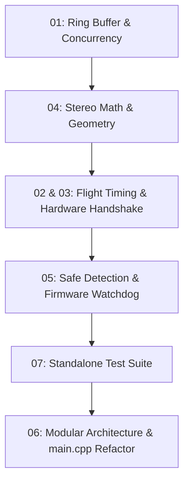

# GolfSim Refactoring & Architecture Master Index

This directory contains the detailed engineering specifications, mathematical proofs, timing models, and implementation plans for refactoring each core subsystem of the GolfSim launch monitor.

---

## Refactor Modules

| Module | Title | Key Topics Covered |
| :--- | :--- | :--- |
| **[01](01_RingBuffer_Concurrency.md)** | **Ring Buffer & Concurrency Safety** | Lock-free circular overwrite semantics, eliminating data races on full buffers, zero-allocation `cv::Mat` preservation (`pop_into`), cache-line alignment (`alignas(64)`), and non-blocking asynchronous `FlightRecorder` disk I/O. |
| **[02](02_Stroboscopic_Flight_Geometry.md)** | **Stroboscopic Flight Geometry & Timing (2.0 ft Range)** | Kinematic timing at 2.0 ft distance for iron shots (50–120 mph), FOV coverage (84 cm), pulse spacing ($\Delta t = 0.8\text{–}1.2\text{ ms}$), 1-to-2 frame hybrid capture, and configurable state machine solve thresholds. |
| **[03](03_Hardware_Trigger_Handshake.md)** | **Hardware Trigger Handshake & Latency Analysis** | Camera STROBE pin $\leftrightarrow$ Arduino D2 handshake, software arming protocol, rigorous USB serial latency jitter analysis (2–8ms OS lag vs 15ms ball flight), and low-latency mitigation architectures. |
| **[04](04_Stereo_Math_Geometry.md)** | **Stereo Mathematics & Coordinate Transformations** | Mathematical correction of Right Camera ray-sphere origin ($O = -R^T T$) and ray direction ($R^T \cdot \text{rayCamR}$), preventing `ITriggerDetector` mutual recursion, and monotonic flight axis sorting. |
| **[05](05_Shot_Detection_IR_Safety.md)** | **Shot Detection & Photobiological IR Eye Safety** | Optical eye safety under IEC 62471 / ANSI RP-27 (Exempt Group RG0), ultra-low duty cycle calculations ($0.0018\%$), two-tier illumination (dim pilot pulse in idle $\to$ armed burst on impact), and Arduino hardware watchdog timer clamps. |
| **[06](06_Architecture_Modularity.md)** | **Architecture Modularity & Application Decoupling** | Strategy for modularizing `main.cpp` (deferred to Phase 5), extracting `ReplayViewer` and `CameraDebugger`, centralized `AppConfig`, and headless `PlaybackCameraNode` for offline simulation. |
| **[07](07_Test_Infrastructure.md)** | **Testing Infrastructure & CTest Integration** | Standalone test runner (`GolfSimTests`), CTest integration, replacing C `assert()` with release-safe assertions (`TEST_ASSERT`), and removing test delays from production startup. |

---

## Phased Implementation Roadmap

