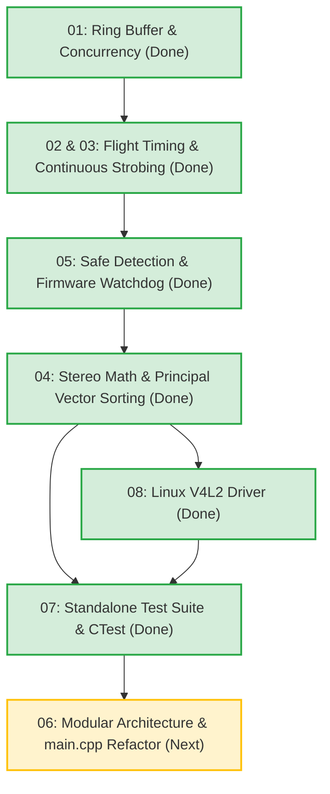

# GolfSim Refactoring & Architecture Master Index

This directory contains the detailed engineering specifications, mathematical proofs, timing models, and implementation plans for refactoring each core subsystem of the GolfSim launch monitor.

---

## Refactor Modules & Implementation Status

| Module | Title | Status | Key Topics & Final Design Decisions |
| :--- | :--- | :---: | :--- |
| **[01](01_RingBuffer_Concurrency.md)** | **Ring Buffer & Concurrency Safety** | **COMPLETED** | Lock-free circular overwrite semantics (`push_overwrite`), zero-allocation frame reuse (`pop_into`), cache-line alignment (`alignas(64)`), and non-blocking background queue for `FlightRecorder` disk writes. |
| **[02](02_Stroboscopic_Flight_Geometry.md)** | **Stroboscopic Flight Geometry & Timing (3.0 ft Range)** | **COMPLETED** | Kinematic timing at 3.0 ft distance (914.4 mm), 10 ms exposure capturing 3 pulses at 300 Hz ($\Delta t = 3.33\text{ ms}$), 1-to-2 frame hybrid capture, and centralized `PipelineTimingConfig`. |
| **[03](03_Hardware_Trigger_Handshake.md)** | **Hardware Trigger Handshake & Latency Analysis** | **COMPLETED** | Analysis showed 19–24 ms OS USB lag makes reactive impact triggering impossible at close range. **Decision**: Implemented **Continuous Low-Power Strobing** (Strategy B) with dual rates (300 Hz active / 10 Hz standby), eliminating USB trigger latency entirely. |
| **[04](04_Stereo_Math_Geometry.md)** | **Stereo Mathematics & Coordinate Transformations** | **COMPLETED** | Mathematical correction of Right Camera ray-sphere origin ($\mathbf{O}_R = -R^T T$) and ray direction ($R^T \cdot \mathbf{d}_R$), precomputed cached extrinsics, elimination of mutual recursion in `ITriggerDetector`, and $2 \times 2$ covariance principal motion vector trajectory sorting. |
| **[05](05_Shot_Detection_IR_Safety.md)** | **Shot Detection & Photobiological IR Eye Safety** | **COMPLETED** | Optical eye safety under IEC 62471 / ANSI RP-27 (Exempt Group RG0). At 300 Hz continuous strobing ($30\mu\text{s}$ pulses), duty cycle is $0.9\%$ and average optical power is $54\text{ mW}$ (over $27\times$ lower than consumer baby monitors). Arduino Timer1 hardware $50\mu\text{s}$ clamp and automatic 5s standby fallback. |
| **[06](06_Architecture_Modularity.md)** | **Architecture Modularity & Application Decoupling** | **PENDING** | Plan for modularizing `main.cpp`, extracting `ReplayViewer` and `CameraDebugger`, centralized `AppConfig`, and headless `PlaybackCameraNode` for offline simulation. |
| **[07](07_Test_Infrastructure.md)** | **Testing Infrastructure & CTest Integration** | **COMPLETED** | Standalone `GolfSimTests` runner over a `golfsim_core` static library, CTest with one entry per case, release-safe `TEST_ASSERT`/`TEST_NEAR`, all test side effects sandboxed, verification code removed from `main()` (`--version` instead), CTest guards that keep test code out of `src/`, and a Clang/`llvm-cov` coverage gate (`GOLFSIM_COVERAGE`) with a ratcheting baseline. Execution plan and coverage roadmap: [07_Test_Infrastructure_Plan.md](07_Test_Infrastructure_Plan.md). |
| **[08](08_Linux_V4L2_Driver.md)** | **Linux V4L2 Camera Driver** | **COMPLETED** | Raw V4L2 MMAP driver mirroring the Media Foundation API behind a `PlatformCameraDriver` alias. GREY → NV12 → YUYV negotiation, manual UVC exposure (100 µs units, 10 ms default), capture-node filtering for index mapping, `STREAMOFF`-based shutdown handshake, and kernel frame timestamps plumbed into `FrameSet`. |

---

## Phased Implementation Roadmap

